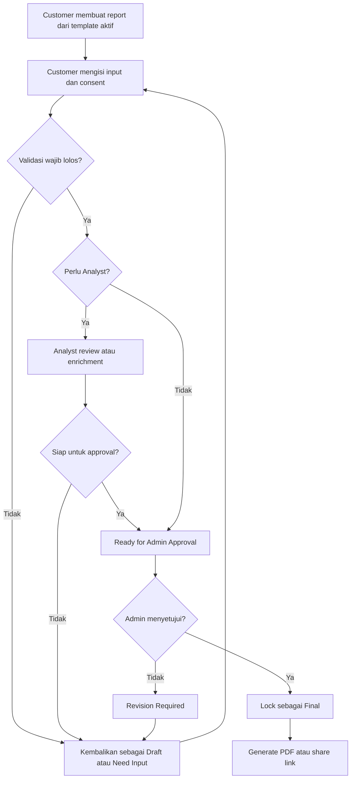

# SOP-RPT-001: Pengelolaan Template dan Finalisasi Report

## Kontrol Dokumen

| Item | Definisi |
|---|---|
| SOP ID | SOP-RPT-001 |
| Process owner | Operations Lead |
| Approver final report | Admin |
| Berlaku untuk | Mini Check, Full Report, Compare Report |
| Effective stage | Controlled platform pilot dan assisted self-service |
| Standar terkait | `STD-RPT-001` |
| Frekuensi review | Bulanan selama MVP |

## 1. Tujuan

SOP ini mengatur pembuatan template, penggunaan template untuk report, jalur finalisasi dengan atau tanpa analyst, approval Admin, revisi, export, dan penghentian versi template.

SOP ini tidak menggantikan `SOP-OPS-001` untuk concierge MVP aktif. Selama masa transisi, report concierge tetap mengikuti quality-review gate yang berlaku. Admin dapat menjalankan peran Quality Reviewer, tetapi keputusan approval harus tetap dicatat sebagai tindakan Admin.

## 2. Peran dan Tanggung Jawab

| Peran | Tanggung jawab |
|---|---|
| Customer | Mengisi input, memberikan consent, dan mengajukan report |
| Analyst | Melakukan review atau enrichment bila ditugaskan |
| Operations Lead | Menjaga proses, SLA, dan penanganan exception |
| Template Author | Menyiapkan template dan change note |
| Privacy Owner | Memeriksa data pribadi, consent, retensi, dan sharing |
| Admin | Mengaktifkan template dan menyetujui setiap final report |
| System | Menjalankan validasi, warning, audit log, lock, dan export |

## 3. Pemilihan Jalur Report

| Kondisi | Jalur |
|---|---|
| Mini Check, input lengkap, tidak ada konflik evidence, tidak ada klaim sensitif | Tanpa Analyst |
| Full atau Compare yang memerlukan interpretasi tambahan | Dengan Analyst |
| Evidence konflik, confidence rendah pada finding penting, atau klaim sensitif | Dengan Analyst |
| Admin menilai risiko approval terlalu tinggi | Dengan Analyst atau dikembalikan ke customer |

Analyst bersifat opsional, tetapi Admin approval selalu wajib.

## 4. Workflow Finalisasi

## 5. Prosedur Operasional Report

### 5.1 Membuat Report

**Trigger:** Customer atau internal user memilih template aktif.

1. Sistem membuat Report ID dan menyimpan Template Version ID.
2. Sistem menetapkan status `draft`.
3. Customer mengisi data lokasi, kebutuhan, concern, dan consent.
4. Sistem autosave dan menampilkan kelengkapan.

**Selesai bila:** Draft tersimpan dan dapat dilanjutkan.

### 5.2 Submit dan Validasi

1. Customer memilih submit.
2. Sistem memeriksa field wajib, format, consent, evidence, dan wording.
3. Jika gagal, sistem menunjukkan masalah spesifik.
4. Jika lolos, sistem menentukan jalur dengan atau tanpa analyst.
5. Alasan routing harus disimpan pada activity log.

**Selesai bila:** Report menjadi `under_review`, `need_input`, atau `ready_for_admin_approval`.

### 5.3 Review Analyst, Bila Diperlukan

1. Analyst memisahkan fakta, interpretasi, dan rekomendasi.
2. Analyst memeriksa sumber, tanggal observasi, dan confidence.
3. Analyst mencatat evidence yang konflik atau belum tersedia.
4. Analyst tidak boleh menggunakan klaim absolut.
5. Analyst mengirim report ke `ready_for_admin_approval`.

**Selesai bila:** Semua temuan penting memiliki dasar dan confidence label.

### 5.4 Admin Approval

1. Admin menjalankan checklist `CHK-RPT-001`.
2. Admin memilih `approve`, `request revision`, atau `reject`.
3. Setiap keputusan wajib memiliki timestamp dan Admin ID.
4. Jika disetujui, sistem mengunci isi, menetapkan document version, dan mengubah status ke `final`.
5. Jika revisi diperlukan, report kembali ke pihak yang relevan dengan catatan spesifik.

**Selesai bila:** Report final terkunci atau catatan revisi telah ditugaskan.

### 5.5 Export dan Sharing

1. Sistem hanya menghasilkan final export tanpa watermark setelah Admin approval.
2. Setiap export menyimpan Report ID, Template Version, Document Version, waktu, dan pengguna.
3. Share link default adalah view-only dan dapat dicabut.
4. Draft export harus memiliki watermark `Draft - Not Final`.

### 5.6 Revision Setelah Final

1. Customer atau internal user membuat revision request.
2. Report final lama tetap read-only.
3. Sistem membuat working copy dengan versi dokumen baru.
4. Perubahan menjalani validasi dan Admin approval ulang.
5. Riwayat versi lama tetap dapat diaudit.

## 6. Prosedur Lifecycle Template

### 6.1 Membuat atau Mengubah Template

1. Template Author membuat change request.
2. Change request menjelaskan tujuan, kategori, dampak, dan versi.
3. Operations Lead memeriksa kelayakan proses.
4. Privacy Owner memeriksa perubahan data, consent, sharing, dan retensi.
5. Tim menguji jalur dengan dan tanpa analyst.
6. Admin menyetujui dan mengaktifkan versi.

### 6.2 Menghentikan Template

1. Admin mengubah status template menjadi `deprecated`.
2. Report baru tidak dapat menggunakan versi tersebut.
3. Report lama tetap terhubung ke versi lama.
4. Setelah masa transisi, Admin dapat menetapkan `retired`.
5. Alasan dan tanggal penghentian harus dicatat.

## 7. SLA Awal

| Aktivitas | Target |
|---|---|
| Validasi sistem setelah submit | Kurang dari 5 menit |
| Routing ke analyst atau Admin | Kurang dari 4 jam kerja |
| Admin approval Mini Check tanpa analyst | 1 x 24 jam |
| Admin approval setelah analyst selesai | Kurang dari 1 hari kerja |
| Tanggapan revision request | Kurang dari 1 hari kerja |

SLA merupakan asumsi operasional dan harus ditinjau dari data aktual.

## 8. Exception dan Eskalasi

| Kondisi | Tindakan |
|---|---|
| Evidence konflik | Wajibkan analyst atau kembalikan sebagai Need Input |
| Klaim absolut atau sensitif | Blok finalisasi sampai direvisi |
| Consent tidak lengkap | Blok submit |
| Admin memiliki konflik kepentingan | Tugaskan Admin lain dan catat |
| Export gagal berulang | Catat incident dan eskalasi ke product/engineering |
| Permintaan penghapusan data | Admin menahan sharing dan menjalankan prosedur privacy |

## 9. Audit Record Wajib

- Report ID dan Template Version ID
- routing decision dan alasannya
- perubahan status
- actor dan timestamp
- catatan analyst, bila ada
- hasil checklist Admin
- approval atau rejection reason
- export dan share activity
- revision history
- privacy request dan penyelesaiannya
